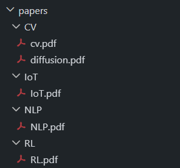
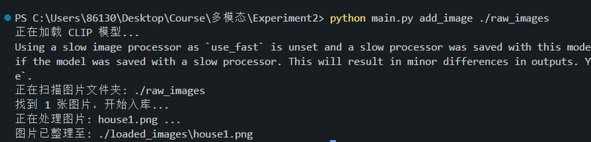
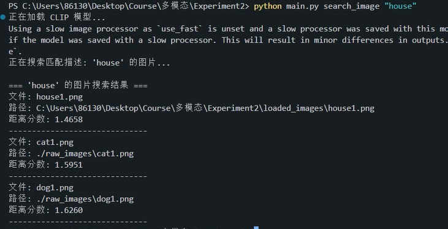

# LocalAI Agent - 本地多模态 AI 智能助手

**LocalAI Agent** 是一个基于 Python 的本地多模态智能助手，专为解决学生和研究人员面临的“文献管理混乱”和“素材检索困难”问题而设计。

本项目利用 **LLM (大语言模型)** 和 **多模态神经网络 (CLIP)** 技术，实现了对本地文献的**自动语义分类**、**语义搜索**，以及对本地图片库的**以文搜图**功能。

---

## 核心功能 (Core Features)

### 1. 智能文献管理
* **语义搜索 (Semantic Search)**: 支持使用自然语言提问。系统会基于向量相似度，返回最相关的论文。
* **自动分类与整理 (Auto-Classification)**:
    * 利用 DeepSeek-chat 大模型api阅读论文摘要，自动将论文归类到指定领域（如 CV, NLP, RL）。
    * **一键批量整理**: 自动扫描乱序文件夹，识别每篇论文的主题，并将其移动到分类好的子文件夹中。
* **智能索引**: 建立本地向量数据库，支持快速检索。

### 2. 智能图像管理
* **以文搜图 (Text-to-Image Search)**: 利用 CLIP 模型实现图文对齐。你可以输入“夕阳下的海滩”或“一只正在睡觉的猫”，系统将从本地图库中找到最匹配的图片。
* **自动归档**: 导入图片时自动建立索引，并将图片统一移动到归档目录，保持原始文件夹整洁。

---

## 技术选型 (Tech Stack)

本项目采用模块化设计，结合了当前最先进的开源模型与工具：

| 模块 | 技术/模型 | 说明 |
| :--- | :--- | :--- |
| **大语言模型 (LLM)** | **DeepSeek API** | 用于理解论文内容并进行高精度分类。 |
| **向量数据库** | **ChromaDB** | 轻量级本地向量数据库，无需安装服务器，持久化存储索引。 |
| **文本嵌入** | **SentenceTransformers** (`all-MiniLM-L6-v2`) | 将论文文本转换为高维向量，用于语义搜索。 |
| **多模态模型** | **OpenAI CLIP**  | 将图片和文本映射到同一向量空间，实现以文搜图。 |
| **PDF 解析** | **pypdf** | 纯 Python 库，稳定高效地从 PDF 中提取文本。 |
| **命令行接口** | **Argparse** | 提供统一、简洁的 CLI 交互体验。 |

---

## 环境配置与安装 (Installation)
所需库为chromadb, sentence-transformers, transformers, torch, Pillow, pypdf, openai
所需模型为embedding模型MiniLM和CLIP模型clip-vit-base, 项目目录中已经包含，也可以自行下载
同时确保设备连接网络，以保证api接口顺利运转

## 推荐目录结构
LocalAI_Agent/
├── main.py——————————入口文件    
|── download/————————输入— 下载好的单篇论文    
├── raw_papers/——————输入— 需要整理的论文文件夹    
├── raw_images/——————输入— 把待整理的图片丢到这里    
├── papers/——————————输出— 整理后的论文会自动移动到这里    
├── loaded_images/———输出— 索引后的图片会自动移动到这里    
└── db/——————————————自动生成— 向量数据库文件    

## 使用说明 (Usage)
所有功能通过 main.py 统一调用

### 语义搜索论文 (Search Paper)
`python main.py search_paper "Lora散射研究的不足是什么？"`

### 添加单篇论文 (Add Paper)
`python main.py add_paper ./downloads/new_paper.pdf`

### 一键批量整理 (Organize)
使用默认主题整理（"CV, NLP, RL, IoT"）：  
`python main.py organize ./raw_papers`  

自定义主题整理：
`python main.py organize ./raw_papers --topics "Physics, Chemistry, Biology"`

整理结果：  

### 批量导入图片 (Add Image)
`python main.py add_image ./raw_images`

### 以文搜图 (Search Image)
`python main.py search_image "house"`  

